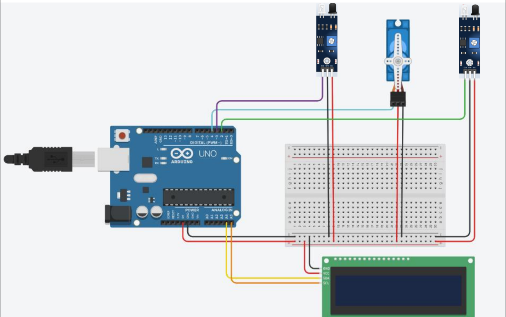
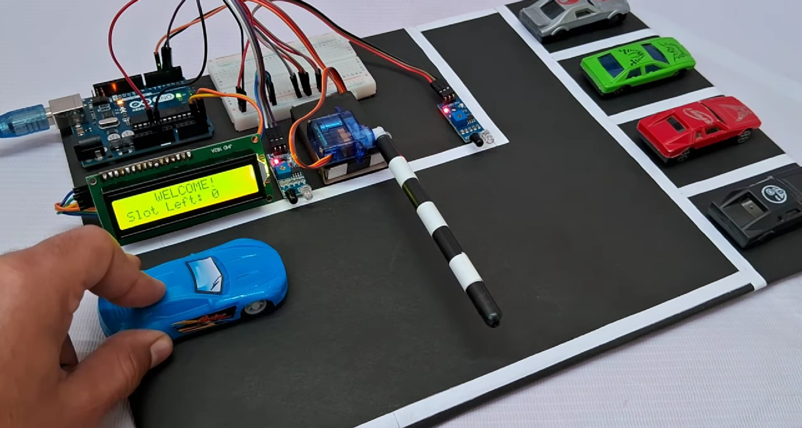

# 📌 Project Description
This project presents an Infrared-Based Vehicle Docking (Smart Parking) System developed using Arduino Uno to automate vehicle entry and exit while efficiently managing parking slots. The system minimizes manual intervention by detecting vehicles using IR sensors and controlling a gate mechanism through a servo motor.

An LCD display provides real-time information about available parking slots, making the system user-friendly and suitable for parking areas such as colleges, offices, malls, and apartments.
# ⚙️ How It Works
- Two IR sensors are placed at the entrance and exit of the parking area.
- When a vehicle approaches the entrance and parking slots are available:
   - The servo motor opens the gate
   - The available slot count decreases
- When a vehicle exits:
   - The gate opens again
   - The slot count increases
- If all slots are occupied, the system displays “Parking Full” on the LCD and prevents entry.
- The gate automatically closes after each vehicle movement.
# 🧠 Key Features
- Automatic vehicle entry and exit detection
- Real-time parking slot monitoring
- Servo-controlled gate automation
- LCD-based status display
- Reduces human effort and parking congestion
- Low-cost and energy-efficient solution
# 🛠️ Components Used
- Arduino Uno
- IR Sensors (2)
- Servo Motor
- 16×2 LCD Display
- Connecting Wires
- Power Supply
## Circuit Diagram

## Overall Look

# 💻 Technologies & Concepts
- Embedded Systems
- Arduino Programming (C/C++)
- Sensor-based Automation
- Real-time Monitoring
# 🎯 Applications
- Smart parking systems
- College and office parking areas
- Shopping malls
- Residential apartments
# 🏆 Exhibition
This project was successfully demonstrated at MEPEXPO’24 – Open House Exhibition conducted at MEPCO Schlenk Engineering College, Sivakasi.
